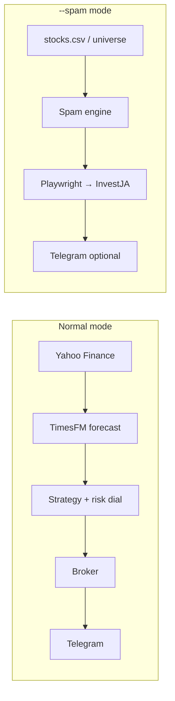

# StockRock

**Automated trading for [InvestJA.org](https://investja.org)** — forecast with **TimesFM**, execute through the platform’s web UI, and ping **Telegram** when trades happen.

There’s also **`--spam` mode**, which does the opposite on purpose: burn fees and lose money as fast as the rules allow (the “lose the most” sub-contest).

---

## What it does

| Mode | Goal | How |
|------|------|-----|
| **Normal** | Trade fee-aware opportunities | Yahoo data → TimesFM (or momentum fallback) → buy/sell via InvestJA or paper broker → Telegram alerts |
| **`--spam`** | Maximize fees / minimize equity | Cheapest-first 1-share loops, up to 3 txns/symbol/day, live Rich dashboard |



---

## Requirements

- **Python 3.11+**
- **Chromium** (Playwright) for live InvestJA trading
- Optional: **TimesFM** + **PyTorch** for the default forecaster
- Optional: **OpenAI** for trade summaries / “explain why” in approval flow

---

## Quick start

```bash
git clone https://github.com/YOUR_USERNAME/stockrock.git
cd stockrock

python3.11 -m venv .venv311
source .venv311/bin/activate

pip install -r requirements.txt
pip install -e .
pip install torch
pip install "git+https://github.com/google-research/timesfm.git"
playwright install chromium
```

Copy config and add your secrets (never commit `.env`):

```bash
cp .env.example .env
```

Set at minimum for live trading:

- `BROKER_MODE=investja`
- `INVESTJA_USERNAME` / `INVESTJA_PASSWORD`
- `TELEGRAM_BOT_TOKEN` / `TELEGRAM_CHAT_ID` (recommended)

Discover Telegram `chat_id`:

```bash
python -m stockrock.telegram_setup
```

Message your bot (`/start`), run the command again, then paste the id into `.env`.

---

## Running

### Normal trading (forecast → trade → notify)

One cycle with the live terminal dashboard:

```bash
stockrock --once
```

Run forever (interval from `POLL_SECONDS` in `.env`):

```bash
stockrock
```

Plain logs, no Rich UI:

```bash
stockrock --plain
```

### Spam / “goon” mode (lose the most)

```bash
stockrock --spam
```

| Flag | Description |
|------|-------------|
| `--spam-mode buy` | Only buy flat names from the universe |
| `--spam-mode sell` | Only sell current holdings |
| `--spam-mode combo` | Alternate buy and sell (default) |
| `--spam --once` | Single pass, then exit |
| `--spam --plain` | No dashboard |
| `--spam-workers N` | Experimental parallel workers (often not worth it on one account) |

In the Rich dashboard, **← / →** or **↑ / ↓** cycle `buy` / `sell` / `combo` without restarting.

Spam mode:

- Ignores TimesFM, advisor, and Telegram approval
- Uses **`stocks.csv`** (or `STOCK_UNIVERSE` / `STOCK_UNIVERSE_CSV` in `.env`)
- Persists per-ticker daily counts in `~/.stockrock/spam_state.json`
- Respects InvestJA rules (e.g. ~$2 CAD floor, 1h hold after buy before sell)

---

## Universe (`stocks.csv`)

Build a large tradable list from Yahoo screeners:

```bash
python screener.py
```

Writes **`stocks.csv`** (NYSE / NASDAQ / TSX, ~$3–$20 CAD). The bot loads it via `STOCK_UNIVERSE_CSV` (default: `stocks.csv`).

---

## Configuration

See **`.env.example`** for all variables. Highlights:

| Variable | Purpose |
|----------|---------|
| `MODEL_PROVIDER` | `timesfm` (default) or fallback behavior |
| `BROKER_MODE` | `paper` or `investja` |
| `STOCK_UNIVERSE` | Inline `TICKER\|YAHOO\|EXCHANGE` list |
| `STOCK_UNIVERSE_CSV` | Path to CSV (default `stocks.csv`) |
| `TRADE_FEE` | Fee per trade (default `25`) |
| `RISK_DIAL` | Position sizing aggressiveness `0.0`–`1.0` |
| `INVESTJA_LOAN_CAP` | Max margin for spam buys when cash is low |
| `POLL_SECONDS` | Sleep between normal cycles / spam passes |

---

## TimesFM

With `MODEL_PROVIDER=timesfm` and TimesFM installed, StockRock uses Google’s model for short-horizon forecasts. If import or inference fails, it **falls back to momentum** and keeps running.

Tested path: **Python 3.11**, `torch`, TimesFM from GitHub (see install steps above).

---

## Telegram

On buys (and sells), the bot can notify your chat. Optional approval flow:

- **Yes** / **No** / **Explain why** buttons
- AI summary when `OPENAI_API_KEY` is set
- Configurable timeout via `TELEGRAM_APPROVAL_TIMEOUT_SEC`

---

## Project layout

```
stockrock/
  main.py        CLI entry (stockrock)
  engine.py      Normal trading loop
  spam.py        --spam fee-burn engine
  investja.py    Playwright login + orders
  broker.py      Paper + InvestJA execution
  data.py        Yahoo Finance
  strategy.py    Signals + risk
  ui.py          Normal Rich dashboard
  ui_spam.py     Spam Rich dashboard
screener.py      Build stocks.csv
stocks.csv       Tradable universe (generated)
```

---

## Disclaimer

Educational software — **not financial advice**. Live trading on InvestJA uses real credentials and real money. You are responsible for compliance with platform rules and your own risk.
